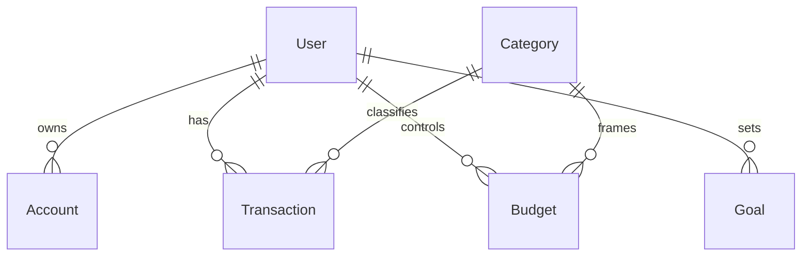

# FinTrackr DB Migration Guide

> Статус: Черновик (подготовка к Phase 6). Этот документ описывает стратегию перехода от JSON-файла `backend/data.json` к полноценной БД. Пока используется флаг окружения `USE_DB` (false по умолчанию).

## Цели миграции
- Масштабируемость и конкурентный доступ
- Надёжность транзакционных операций (балансы, бюджеты)
- Уменьшение размера монолитного `server.js` за счёт репозиторного слоя
- Подготовка к аналитическим запросам (агрегации, отчёты)

## Текущая архитектура хранения
- Источник: один файл `data.json`
- Коллекции (12): users, accounts, categories, transactions, budgets, goals, planned, subscriptions, rules, recurring, refreshTokens, tokenBlacklist, bankConnections
- Репозитории (in-memory): реализация фильтрации/поиска внутри массива
- Бизнес-логика опирается на синхронные операции чтения/записи

## Целевая архитектура
- Абстракция через `DbBaseRepository` (уже создан черновик)
- Специализированные репозитории расширяют базовый: AccountsRepository, TransactionsRepository и др.
- Асинхронные CRUD операции возвращают Promises
- Поддержка пагинации и фильтрации на уровне БД (offset/limit, query operators)
- Возможные бекенды: MongoDB (по умолчанию), PostgreSQL (альтернатива)

## Флаги окружения
| Переменная | Назначение | Пример |
|-----------|-----------|--------|
| `USE_DB` | Включить DB режим | `USE_DB=true` |
| `DB_BACKEND` | Тип хранилища (`mongo`/`pg`) | `DB_BACKEND=mongo` |
| `FINTRACKR_DISABLE_PERSIST` | Отключить запись (тесты) | `FINTRACKR_DISABLE_PERSIST=true` |

## Этапы миграции
1. Подготовка (Phase 5)
   - [x] Создать `DbBaseRepository` (методы findBy, paginate)
   - [x] Интегрировать в AccountsRepository/TransactionsRepository (условный режим)
   - [x] Добавить стартовый лог о режиме (JSON vs DB)
   - [ ] Документировать схему (`db/schema.md` расширить)
2. Минимальная реализация подключения
   - [ ] Реализовать модуль `db/connection.js` (фактическое подключение)
   - [ ] Создать адаптер для MongoDB (коллекции = матчи json-структуры)
   - [ ] Добавить graceful shutdown (закрыть коннект)
3. Репозитории в DB режиме
   - [ ] UsersRepository (hash + уникальность email)
   - [ ] CategoriesRepository
   - [ ] BudgetsRepository (обновление `spent` атомарно)
   - [ ] GoalsRepository
   - [ ] Subscriptions / Recurring / Rules / Planned
4. Бизнес-логика побочных эффектов
   - [ ] Транзакции: атомарное обновление account.balance + бюджетов
   - [ ] Каскад при удалении category (budgets/planned/tx.category_id=null)
   - [ ] Верификация currency conversion на уровне БД (расчёт в запросах)
5. Миграционный скрипт
   - [ ] Реализация `db/migrate-from-json.js` с поэтапной загрузкой
   - [ ] Валидация количества записей
   - [ ] Лог несоответствий (пропуск повреждённых записей)
   - [ ] Возможность повторного запуска (idempotent)
6. Тестирование
   - [ ] Запуск существующих unit-тестов в DB режиме (дополнить mock подключения)
   - [ ] Добавить e2e ветку для DB (`USE_DB=true`) 
   - [ ] Нагрузочный тест (массовое добавление transactions)
7. Оптимизация
   - [ ] Индексы (users.email, transactions.user_id+date, budgets.user_id+month+category_id)
   - [ ] Агрегации (расходы по категориям, cashflow)
8. Декомиссия JSON
   - [ ] Удалить прямые обращения к `data.json` вне dataService
   - [ ] Исключить старый путь обновления балансов
   - [ ] Обновить README / DEPLOYMENT.md

## Структура данных (черновик)

### Users
- `_id` (ObjectId / UUID)
- `email` (unique)
- `password_hash`
- `name`
- `preferences` (currency, theme)

### Accounts
- `_id`
- `user_id` (index)
- `name`
- `currency`
- `balance`
- `type` (checking/savings/card)

### Transactions
- `_id`
- `user_id` (index)
- `account_id` (index)
- `category_id` (nullable)
- `amount`
- `currency`
- `type` (income|expense)
- `date` (index)
- `description`
- `external_ref` (nullable, for bank import)

### Budgets
- `_id`
- `user_id` (index)
- `category_id` (index)
- `month` (YYYY-MM, index)
- `limit`
- `spent`
- `currency`

(Дополнить для goals, planned, subscriptions, rules, recurring)

## Миграционная стратегия
1. Snapshot: Заблокировать запись (включить `FINTRACKR_DISABLE_PERSIST=true`)
2. Чтение `data.json` в память
3. Вставка по коллекциям в порядке: users -> categories -> accounts -> budgets -> goals -> planned -> subscriptions -> rules -> recurring -> transactions (из-за ссылок на accounts/categories)
4. Подсчёт вставленных vs ожидаемых
5. Отчёт и валидация (ошибки записать в отдельный файл `migration-errors.log`)
6. Смена флага `USE_DB=true` и перезапуск
7. Smoke тест (логин, список транзакций, создание транзакции, обновление баланса)

## Проверки целостности
- Accounts.balance == Σ(транзакции по счёту с учётом вида и конвертаций)
- Budgets.spent == Σ(расходные транзакции по категории за месяц, приведённые к валюте бюджета)
- Уникальность email в users
- Отсутствие dangling ссылок (category_id без категории)

## Rollback план
1. Отключить `USE_DB`
2. Вернуться к резервной копии `data.json.bak` (создаётся перед миграцией)
3. Очистить коллекции в БД если необходимо

## Логирование
- Стартовое сообщение (уже реализовано): режим и backend
- During migration: прогресс по коллекциям + скорость вставки
- Post-migration: итоговое время, количество пропусков

## Риски
| Риск | Митигирование |
|------|---------------|
| Расхождение balances/budgets | Автоматические проверки после миграции |
| Частичное падение скрипта | Идемпотентные upsert операции |
| Производительность массовой вставки | Batch размер (например 500 записей) |
| Смена схему до завершения миграции | Freeze схемы на период выполнения |

## Следующие шаги
- Реализовать фактическое подключение MongoDB
- Расширить DbBaseRepository абстракцией query builders
- Подготовить тестовый прогон миграции с небольшой выборкой

---
*Последнее обновление: (auto-generated draft, заполнить при изменениях)*
