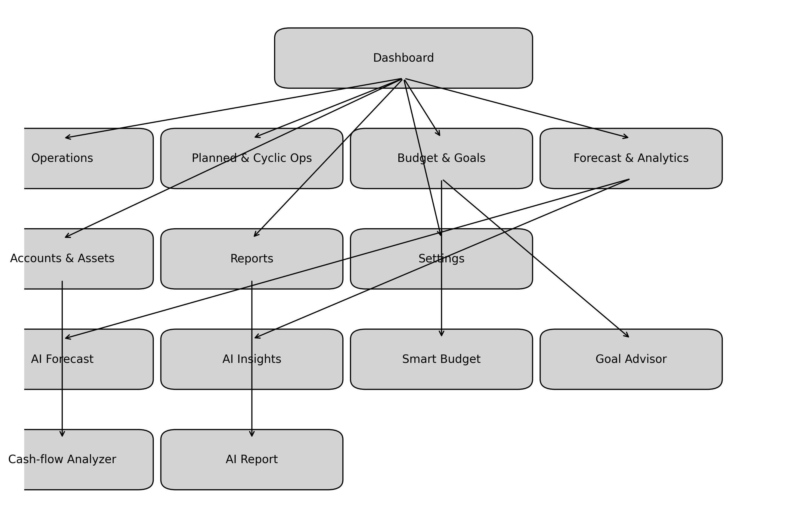

# Личный кабинет пользователя — подробное техническое задание

Этот документ описывает расширенный модуль личного кабинета для приложения **FinTrackr**.  В нём собраны требования к новому функционалу, который планируется реализовать в будущем: учёт операций, планирование и прогнозирование, управление бюджетами и целями, а также интеллектуальная аналитика.

## 1. Цель модуля

Личный кабинет должен предоставить пользователю полный контроль над личными финансами.  Ключевые задачи:

* учёт доходов, расходов и переводов между счетами;
* анализ финансового поведения через отчёты и прогнозы;
* планирование будущих платежей и накоплений;
* получение персонализированных рекомендаций по оптимизации бюджета;
* управление регулярными (цикличными) и разовыми плановыми операциями.

## 2. Роли пользователей

| Роль                             | Описание                                                                  |
|----------------------------------|---------------------------------------------------------------------------|
| **Пользователь**                 | Основной субъект учёта. Создаёт операции, категории, счета, планы, цели. |
| **Система (AI‑аналитик)**        | Генерирует прогнозы, рекомендации и автоматические уведомления.          |
| **Администратор (только web)**   | Управляет пользователями, тарифами и аналитикой приложения.              |

## 3. Основная структура личного кабинета

### 3.1. Главная панель (Dashboard)

Панель отображает краткий обзор состояния финансов: общий баланс, доходы и расходы за период, линейный график динамики бюджета и виджеты «Финансовое здоровье» и «AI‑прогноз».  Также выводятся уведомления о предстоящих платежах, превышении лимитов и советы.

### 3.2. Раздел «Операции»

В этом разделе пользователь может просматривать, добавлять, редактировать и удалять операции.  Поддерживаются категории (еда, транспорт, жильё и т. д.), теги, заметки и выбор счёта (карта, наличные, криптовалюта).  Возможен импорт данных из CSV/Excel/банковских выписок.  Предусмотрены фильтры по дате, категории, сумме и типу операции.

### 3.3. Раздел «Плановые и цикличные операции»

Позволяет автоматизировать повторяющиеся транзакции и разовые будущие платежи.  Пользователь задаёт периодичность (день, неделя, месяц, год или произвольный интервал), получает уведомления и может видеть запланированные операции в календаре.  Цикличные расходы и доходы автоматически добавляются в бюджет.

### 3.4. Раздел «Бюджет и цели»

Здесь настраиваются бюджеты по категориям (например, 400 € в месяц на еду), отслеживается процент исполнения и создаются финансовые цели (накопить на поездку, покупку и т. д.).  Средства могут автоматически резервироваться, а система прогнозирует достижение цели с учётом текущих темпов сбережений.

### 3.5. Раздел «Прогнозирование и аналитика»

Система использует исторические данные и модели машинного обучения для предсказания доходов и расходов на 7, 30 или 90 дней.  Предусмотрены графики, анализ сезонности, выявление рискованных зон (где возможен выход за лимит) и прогноз баланса.  AI‑советы помогают оптимизировать траты: например, предложение сократить расходы на транспорт, чтобы быстрее достичь цели.

### 3.6. Раздел «Счета и активы»

Пользователь может добавить банковские карты, наличные кошельки, криптокошельки и инвестиционные счета.  Для каждого счёта отображаются баланс и история операций, поддерживаются разные валюты с автоматическим пересчётом.  Можно выбрать главный счёт.

### 3.7. Раздел «Отчёты»

Генерируются месячные и годовые отчёты с круговыми диаграммами по категориям, анализом трендов и экспортом в PDF/Excel/CSV.  Предусмотрен «AI‑отчёт» — краткий текстовый анализ: например, сообщение о 12 % экономии бюджета и доминирующей категории расходов.

### 3.8. Раздел «Настройки»

Позволяет изменить профиль (аватар, имя, базовая валюта, язык, часовой пояс), настроить безопасность (2FA, PIN, биометрия), управление уведомлениями (Telegram, e‑mail, push), интеграции (банковские API, криптоботы, Google Sheets) и тарифный план (Free/Premium/AI‑Plus).

## 4. Дополнительные интеллектуальные функции

| Функция                | Описание                                                                                |
|-----------------------|------------------------------------------------------------------------------------------|
| **AI‑прогноз**         | Модель машинного обучения анализирует историю и предсказывает доходы/расходы на период. |
| **AI‑инсайты**         | Текстовые рекомендации: например, сообщение о превышении обычных трат по категории.    |
| **Smart‑Budget**       | Автоматическое распределение бюджета по категориям с учётом приоритетов.                |
| **Goal‑Advisor**       | Предлагает оптимальные темпы накопления для достижения финансовых целей.               |
| **Cash‑flow‑analyzer** | Анализирует притоки и оттоки, классифицирует по источникам.                             |

## 5. Структура данных (основные сущности)

| Сущность         | Поля                                                                                          |
|-------------------|---------------------------------------------------------------------------------------------|
| **User**         | `id`, `name`, `email`, `password_hash`, `currency`, `settings`                               |
| **Account**      | `id`, `user_id`, `name`, `type`, `balance`, `currency`                                       |
| **Transaction**  | `id`, `user_id`, `account_id`, `type` (income/expense), `category_id`, `amount`, `date`, `note`, `is_recurring` |
| **Category**     | `id`, `user_id`, `name`, `color`, `type`                                                     |
| **Budget**       | `id`, `user_id`, `category_id`, `amount_limit`, `period`                                    |
| **Goal**         | `id`, `user_id`, `title`, `target_amount`, `current_amount`, `deadline`                      |
| **Forecast**     | `id`, `user_id`, `date`, `predicted_income`, `predicted_expense`                             |
| **Notification** | `id`, `user_id`, `type`, `message`, `date`, `status`                                         |

## 6. UX/UI принципы

Интерфейс следует минималистичным и неоморфическим тенденциям: спокойные пастельные оттенки, акценты на графиках и виджетах, адаптивная вёрстка для мобильных и десктопных устройств и поддержка тёмной темы.

## 7. Безопасность

Данные должны шифроваться на сервере (AES‑256), авторизация проходить через JWT, предусмотрено резервное копирование и соответствие GDPR.

## 8. Этапы реализации

| Этап        | Функции                                                                          |
|-------------|----------------------------------------------------------------------------------|
| **MVP**     | Регистрация, операции, категории, отчёты, базовый дашборд.                       |
| **Stage 2** | Бюджеты, цели, плановые операции, отчёты PDF.                                    |
| **Stage 3** | AI‑прогноз, рекомендации, интеграции, Smart‑Budget.                              |
| **Stage 4** | Мобильное приложение, биометрическая авторизация, офлайн‑режим.                  |

## 9. Навигация (функциональная карта)

Ниже приведена схема навигации между разделами личного кабинета и интеллектуальными модулями.  Она демонстрирует связи между основными разделами и AI‑подсистемами:

Файл `navigation_diagram.png` хранится в директории `docs/` и может быть вставлен в презентацию или документацию (например, в Draw.io или Word).
